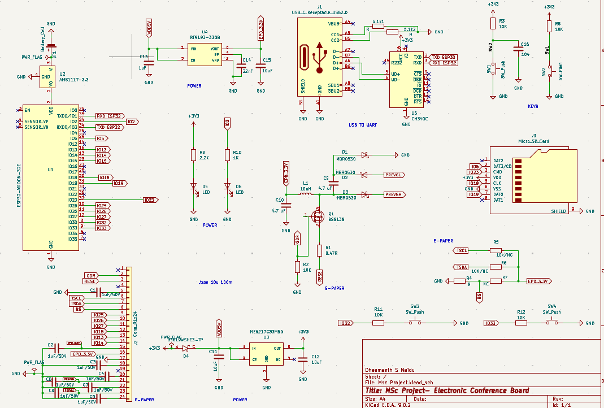
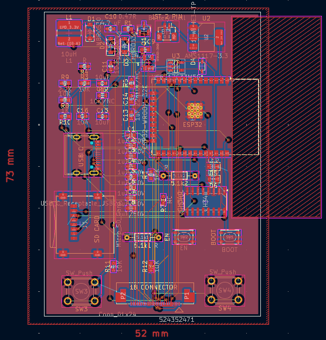
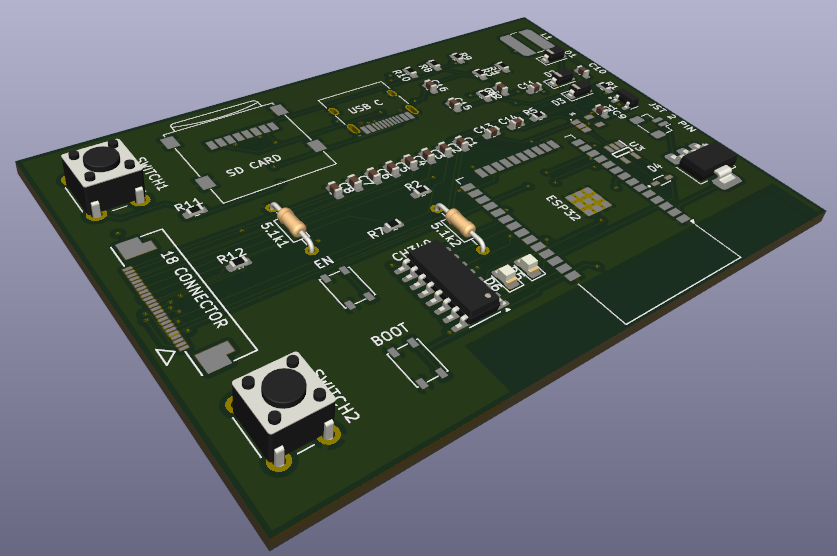

# Electronic Conference Badge

## Project Overview

This project investigates the design and development of a smart, energy-efficient electronic conference badge intended to replace traditional printed name tags used at events and meetings. The system is built around a compact microcontroller board, which controls a 3.52-inch e-paper display capable of showing attendee names, designations, or other event-specific content. Unlike conventional displays, e-paper offers excellent readability in various lighting conditions, including bright sunlight, while consuming very little power, making it ideal for multi-day usage on a single charge. 

The badge is designed to be interactive and easily programmable, featuring a set of physical buttons for input and wireless communication that allow it to connect with other badges or systems for capabilities such as contact exchange, activity tracking, or peer-to-peer messaging. A SD card reader also provides the flexibility to update the badge content without relying on an internet connection, making it useful in both connected and standalone scenarios

To reliably support all of these features, the hardware integrates a combination of power management circuits to ensure stable operation across different use cases. These include a voltage regulator and boost converter to provide the necessary voltages for the logic components and display. The board is powered by a 3.7V rechargeable battery and is charged or programmed via a USB Type-C connector. 

All design work, including schematic creation and PCB layout, was completed using the open-source KiCAD 9 design tool, ensuring that the board is optimized for surface-mount manufacturing. By combining low-power electronics, open-source design tools, and a thoughtful user interface, this badge system offers a modern, reusable, and sustainable alternative to traditional paper-based identification at events. 

## Hardware Preview

### Schematic


### PCB Layout


### 3D Render


## 🛠️ Requirements

To view, edit, or manufacture this project, the following software is required:

* **KiCad 9.0 or later**
* A computer running Windows, Linux, or macOS
* Optional: Gerber viewer for manufacturing file verification

## 📥 Installation

### 1. Install KiCad

Download and install the latest version of KiCad from the official website:

https://www.kicad.org/download/

Verify that KiCad is correctly installed by launching the application and opening the Project Manager.

### 2. Clone the Repository

```bash
git clone https://github.com/<your-username>/<repository-name>.git
cd <repository-name>
```

Alternatively, download the project as a ZIP file and extract it to your desired location.

### 3. Open the Project

1. Launch **KiCad 9**.
2. Select **File → Open Project**.
3. Navigate to the project directory.
4. Open the `.kicad_pro` file.

The project schematic, PCB layout, symbols, footprints, and manufacturing files will now be available through the KiCad Project Manager.

## 📂 Project Structure

```text
Project/
│
├── Hardware/
│   ├── Schematics/
│   ├── PCB/
│   ├── Libraries/
│   └── Manufacturing/
│
├── Documentation/
│   ├── Images/
│   └── Datasheets/
│
└── README.md
```

## 🔧 Editing the Design

### Schematic

1. Open the project in KiCad.
2. Click **Schematic Editor**.
3. Modify components, connections, or annotations as required.
4. Run **Electrical Rules Check (ERC)** before saving changes.

### PCB Layout

1. Open **PCB Editor**.
2. Update the PCB from the schematic if changes have been made.
3. Verify component placement and routing.
4. Run **Design Rules Check (DRC)** to identify any layout issues.

## 📤 Generating Manufacturing Files

To generate fabrication files:

1. Open the PCB Editor.
2. Select **File → Fabrication Outputs → Gerbers**.
3. Generate Gerber files for all required layers.
4. Generate drill files using **Generate Drill Files**.
5. Review the outputs using a Gerber viewer before sending them to a PCB manufacturer.

## 🔋 Hardware Features

* 3.52-inch E-Paper Display
* Low-power microcontroller platform
* Wireless communication capability
* Physical navigation buttons
* MicroSD card support
* USB Type-C charging and programming
* Rechargeable 3.7 V Li-ion battery support
* Integrated voltage regulation and boost conversion circuitry
* Surface-mount optimized PCB design

## 🤝 Contributing

Contributions, suggestions, and improvements are welcome. Please fork the repository, create a feature branch, and submit a pull request describing your changes.

